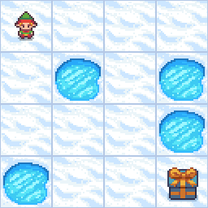

# FrozenLake Deep Q-Learning
As an extension to [Q-learning project](https://github.com/SameerR007/q-learning), this project implements Deep Q-Learning algorithms to solve the FrozenLake-v1 environment from OpenAI's Gymnasium. The goal is to train an agent to navigate a 4x4 grid of ice to reach the goal while avoiding holes.

## Overview
This project employs Deep Q-Learning (DQN) to solve the FrozenLake-v1 environment. Deep Q-Learning extends the traditional Q-learning algorithm by using a neural network to approximate the Q-values, making it suitable for environments with larger state spaces. The agent uses a neural network to approximate the Q-values, which allows it to handle larger and more complex environments compared to the traditional Q-table approach. Training involves experience replay and updating the target network periodically to stabilize learning.

- **Environment**: FrozenLake-v1 (4x4 map, deterministic movements)
- **Algorithm**: Deep Q-Learning (DQN) with Experience Replay and Target Networks
- **Training Output**: A neural network that approximates Q-values for each state-action pair
- **Visualization**: The behaviour of the agent after training for 100 episodes is saved in `test.png`

## Code Implementation

The DQN implementation consists of several key components:

1. **Neural Network Model**: A neural network approximates the Q-values. It includes an input layer, a hidden layer with ReLU activation, and an output layer with a linear activation function.

2. **Experience Replay**: This technique involves storing past experiences in a replay memory and sampling from it to break the correlation between consecutive experiences.

3. **Target Network**: A target network provides stable Q-value targets during training. The weights of the target network are periodically updated to match the policy network.

4. **Training Loop**: The agent interacts with the environment, stores experiences, and periodically samples from the replay memory to train the neural network.

## Resources 
The implementation and understanding of the algorithms are based on the following resources:

- [Deep Q-Learning Algorithm - Hugging Face](https://huggingface.co/learn/deep-rl-course/unit3/deep-q-algorithm)
- [Deep Q-Learning/Deep Q-Network (DQN) Explained - Johnny Code](https://www.youtube.com/watch?v=EUrWGTCGzlA)

## Update

An alternative to value based approaches such as **Q-Learning** and **Deep Q-Learning (DQN)**, is Policy based approach for eg. **Policy Gradient** method, which directly optimizes the policy by learning a probability distribution over actions rather than estimating action values. Unlike DQN’s deterministic approach, Policy Gradient methods use a stochastic policy, sampling actions from a probability distribution, which inherently supports exploration and adapts well to both discrete and continuous action spaces. While DQN relies on experience replay and target networks for stability, Policy Gradient simplifies training by updating the policy based on episode rewards, making it especially effective in environments with stochastic elements or continuous actions.

For more details, please visit [Policy Gradient Method (Reinforce Algorithm) Repository](https://github.com/SameerR007/pgm-reinforce).
